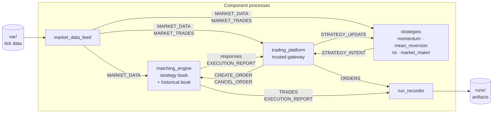
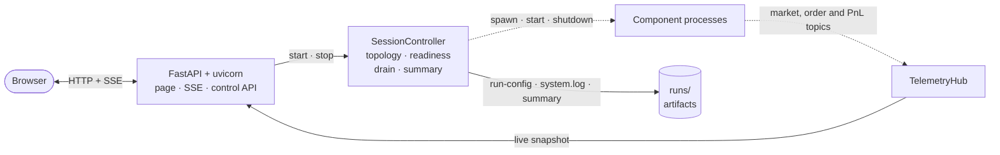
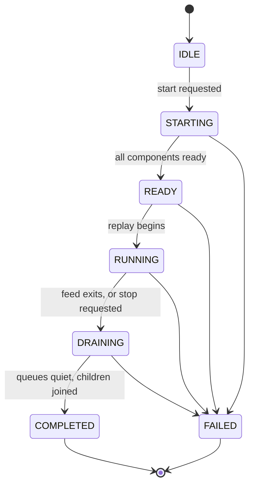

# MAFS 5360 Group 1 Exchange Simulator

## Group Members

- LIM, Hyungmin (group leader)
- JITENDRA JAIN, Jai
- KONG, Lingtong

## Architecture and decisions

Start with [`docs/README.md`](docs/README.md) for the current architecture,
cross-component message contracts, accepted decision records, and unresolved
questions. These documents are the source of truth when temporary pull-request
code and settled design differ.

### Component and message flow

Every component is a separate process. They never call each other; they exchange
typed messages over topic-validated `multiprocessing.Queue` fan-out, and the
whole topology is declared centrally in `system_controller/component_specs.py`.



Two rules the diagram encodes. Strategies **cannot** reach the matching engine:
they publish intent, and only the trading platform may turn it into an order
request, which is where ownership and tick/lot conformance are enforced. And
historical trades (`MARKET_TRADES`) never mix with simulated ones (`TRADES`).

### Control plane

The web layer never touches components directly. It drives `SessionController`,
which owns process supervision, and reads a `TelemetryHub` that observes the
system through the same declared topology as every other component.

`FastAPI`, `SessionController` and `TelemetryHub` all live in the single main
process; everything below the dotted arrow is a spawned child.



### Session lifecycle

Replay does not start until every component reports ready. The feed process
exiting *is* end of stream.



See [ADR 0006](docs/decisions/0006-strategy-processes-and-intent-channel.md) and
[ADR 0007](docs/decisions/0007-session-lifecycle-and-web-control.md).

## Environment Setup (Python 3.13)

Use Python **3.13.x** (latest patch version is fine).

### Option 1: `venv`

```bash
python3.13 --version
python3.13 -m venv .venv
source .venv/bin/activate
python -m pip install --upgrade pip
pip install -r requirements.txt
```

### Option 2: `conda`

```bash
conda create -n exchange-simulator python=3.13 -y
conda activate exchange-simulator
python -m pip install --upgrade pip
pip install -r requirements.txt
```

## Running the demo

Put a historical tick file under `var/` (gitignored), then:

```bash
pip install -e .
python -m exchange_simulator          # dashboard on http://127.0.0.1:8000
```

Open the dashboard and press **Start**. The controller launches the feed,
matching engine, trading platform, one process per strategy, and the run
recorder, waits for every component to report ready, then replays. The
**Market**, **Strategies**, and **Session** tabs show the book, per-strategy
inventory and PnL, and component health while the run proceeds.

Each run writes `runs/<run-id>/` containing `run-config.json`, `system.log`,
`orders.csv`, `executions.csv`, `simulated-trades.csv`, and `summary.json`.

Without an editable install, prefix commands with `PYTHONPATH=src`.

### Configuration

| Variable | Default | Purpose |
|---|---|---|
| `EXCHANGE_SIMULATOR_HOST` | `127.0.0.1` | Interface to bind; also `--host` |
| `EXCHANGE_SIMULATOR_PORT` | `8000` | Port to bind; also `--port` |
| `EXCHANGE_SIMULATOR_USER` | `admin` | Dashboard username |
| `EXCHANGE_SIMULATOR_PASSWORD` | unset | Dashboard password; **no password means no authentication** |

Serving beyond localhost, with authentication on:

```bash
export EXCHANGE_SIMULATOR_HOST=0.0.0.0
export EXCHANGE_SIMULATOR_USER=demo
export EXCHANGE_SIMULATOR_PASSWORD='choose-something'
python -m exchange_simulator
```

HTTP Basic guards every route including the SSE stream. Credentials travel
base64-encoded, not encrypted, so this is a barrier against a curious colleague
on the same LAN — not a substitute for TLS on an untrusted network.

Start and Stop are unauthenticated when no password is set, so anyone able to
reach the port can halt a running demo. The app logs a warning when it binds a
non-loopback interface without one.

## Tests

```bash
pytest
```
