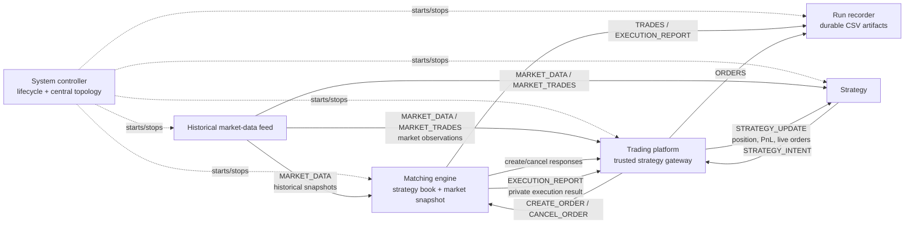

# Exchange simulator architecture

Status: **Accepted baseline; end-to-end integration in flight (PR #28)**
Last updated: **2026-08-03**

## Purpose

The simulator replays historical five-level market data, accepts strategy orders,
matches those orders using a deterministic simulation model, and returns order
responses and executions through a multiprocessing message bus.

The MVP favors a coherent, demonstrable system over a fully reconstructed
exchange. Advanced queue-position and market-impact models can be added behind
explicit interfaces after the baseline works end to end.

## Current repository state

| Area | Status | Notes |
|---|---|---|
| Schemas and multiprocessing message bus | On `master` | Topic permissions, type validation, component registration, and topology finalization exist. |
| Historical market-data feed | On `master` | Streams five-level snapshots and historical trade prints for one instrument, with fixed-interval pacing and a stoppable component runner. |
| Matching engine and order book | On `master` | Q1 and Q3 behavioural policies remain open. |
| System controller | In flight (PR #28) | Full topology, readiness barrier, end-of-stream detection, drain, failure detection, and run artifacts. See [ADR 0007](decisions/0007-session-lifecycle-and-web-control.md). |
| Run recorder | In flight (PR #28) | Writes `orders.csv`, `simulated-trades.csv`, and `executions.csv`; `ORDERS` now has a producer. |
| Trading platform | In flight (PR #28) | Trusted gateway: owns order-to-strategy mapping, tick/lot conformance, portfolios, and the `ORDERS` stream. |
| Strategies | In flight (PR #28) | Momentum, mean-reversion, RSI, and market-maker demo strategies, one process each. See [ADR 0006](decisions/0006-strategy-processes-and-intent-channel.md). |
| Dashboard | In flight (PR #28) | FastAPI page with live price chart, order book, per-strategy inventory and PnL, and component health. |

## Target component flow

The diagram shows logical ownership. Physical processes and exact subscriptions
are declared centrally through `ComponentSpec` objects.

## Component responsibilities

### System controller

- Own the complete component topology.
- Register all component specs before finalizing the bus.
- Create component buses and processes.
- Coordinate startup and graceful shutdown.
- Own configuration such as data path, instrument, trading date, and replay mode.
- Avoid implementing matching, replay parsing, or platform business logic.

### Historical market-data feed

- Stream CSV or gzip input without loading a full day into memory.
- Publish ordered five-level `MarketDataSnapshot` messages.
- Publish historical `MarketTradePrint` messages reconstructed from source data.
- Preserve historical data as fixed ground truth.
- Never alter future historical messages because of simulated strategy trades.
- Signal completion by exiting: the feed process terminating is end of stream,
  per [ADR 0007](decisions/0007-session-lifecycle-and-web-control.md).

### Matching engine

- Accept validated create and cancellation requests from the trading platform.
- Maintain strategy orders using the selected price/time policy.
- Use the latest historical snapshot as external liquidity under the baseline
  two-book model.
- Publish responses on response topics, simulated trades on `TRADES`, and
  execution reports through the agreed private-routing path.
- Keep historical trade prints and simulated executions semantically separate.

### Trading platform

- Act as the trusted gateway between strategies and the matching engine.
- Track strategy/order ownership.
- Validate requests that belong at the gateway boundary.
- Correlate responses and execution reports with the originating strategy.
- Maintain positions, cash, and order state when those modules are implemented.

Cancellation authorization and execution-report routing live exclusively here.
Strategies publish `RequestTopic.STRATEGY_INTENT`; only the platform may turn an
intent into a create or cancel request, and it verifies that a strategy owns an
order before forwarding a cancellation. Settled by
[ADR 0006](decisions/0006-strategy-processes-and-intent-channel.md).

### Strategy

- Produce order intent through the trading platform.
- Consume market observations and its own order/execution state.
- Avoid direct access to matching-engine internals.

### Run recorder

- Act as a trusted internal consumer of order state, simulated trades, and
  execution reports.
- Write each supported topic to a separate CSV artifact without merging
  historical and simulated trade provenance.
- Flush each row as it is written and, after shutdown is requested, continue
  consuming until the recorder inbox has been quiet for one receive timeout.
- Leave run identifiers, output-root configuration, producer shutdown ordering,
  and final summaries to the system controller.

The trading platform is the `ORDERS` producer, so `orders.csv` is written. See
[ADR 0006](decisions/0006-strategy-processes-and-intent-channel.md).

## Accepted invariants

1. **Historical data is immutable ground truth.** Simulated activity does not
   rewrite later snapshots in the baseline model.
2. **Historical and simulated trades are different streams.**
   `MARKET_TRADES` is historical; `TRADES` is simulated.
3. **One topic has one validated message contract.** Do not disable validation to
   place unrelated schemas on the same topic.
4. **The topology is finalized before buses are created.** Runtime component
   registration is not part of the MVP.
5. **The complete topology is visible centrally.** Components contain behavior;
   the composition root owns system wiring.
6. **Timestamps come from the simulation where available.** Wall-clock timestamps
   used for engine-generated events must not be confused with historical event
   time.
7. **One application command starts the complete presentation system.** Manual
   per-component startup is not part of the demo contract.
8. **A run is observable and leaves durable results.** Live progress and
   inspectable output files are required behavior.

## Demo runtime requirement

The complete system must be launched at the beginning of the team presentation,
run autonomously while the slides are presented, and provide results for
inspection afterward. This makes lifecycle and observability part of the minimum
architecture.

The target runtime must:

- start the message bus, historical feed, matching engine, trading platform,
  strategy, and run recorder from one command;
- hold replay behind a readiness barrier until every required consumer is ready;
- support a configurable replay pace suitable for a presentation-length run;
- report periodic progress and component health;
- write orders, executions, logs, configuration, and a final summary to a
  run-specific output directory;
- drain messages, flush files, and stop child processes cleanly;
- fail visibly and return a non-zero status when a required component fails.

See [ADR 0005](decisions/0005-one-command-demo-runtime.md) and the
[demo runbook](demo-runbook.md) for the operational contract.

## Baseline matching model

The accepted MVP baseline uses two logical liquidity stores:

- a strategy order book maintained by the matching engine; and
- the latest five-level historical snapshot, refreshed by the feed.

The model deliberately ignores feedback from simulated trades into future
historical snapshots. This keeps replay deterministic and aligns with the team's
decision to prioritize a reliable demo.

The matching implementation exposes an optional market-depth impact model for
incoming aggressive orders that consume historical liquidity. The application
controller continues to select `NoImpactModel` for the MVP. Every model must
honor a limit order's price; if an adjusted market price would be worse than the
limit, that level is not executable. Snapshot-triggered passive fills retain the
resting order's price until the passive-fill policy is explicitly resolved.

The following details are not yet accepted and must not be inferred from the
merged matching-engine implementation:

- whether participant liquidity has priority over a better historical price;
- the execution price when a later snapshot touches a resting strategy order;
- the exact passive-fill and queue-position model.

See [Open questions](open-questions.md).

## Integration sequence

1. Keep the merged historical-feed and matching-engine foundations aligned with
   their stable topic/schema contracts.
2. Create a dedicated central topology module containing all component specs.
3. Add the trading platform as the only order-request gateway.
4. Wire the feed, engine, and platform through the real multiprocessing bus.
5. Add coordinated startup, readiness, failure detection, end-of-stream, and
   shutdown behavior.
6. Add run configuration, progress reporting, and durable result writers.
7. Add one end-to-end fixture through the presentation entry point: replay a
   small day fragment, submit an order, observe the response/execution, and
   terminate every process.
8. Rehearse a full presentation-duration run with the documented demo
   configuration.
9. Add multi-instrument orchestration and advanced matching models only after the
   baseline flow is stable.

## MVP non-goals

- Reconstructing the true order-by-order historical book from five-level
  snapshots.
- Predicting how real market participants would react to simulated orders.
- Allowing simulated trades to rewrite historical price trajectories.
- Dynamic component registration after topology finalization.
- Supporting every instrument and market session before a one-instrument,
  one-day flow works end to end.

## Guidance for code and AI reviews

Before proposing a cross-component change:

1. Check the accepted decision records.
2. Check whether the relevant item is still open.
3. Identify the producer, topic, schema, and consumer.
4. Preserve historical-versus-simulated provenance.
5. Avoid treating temporary PR code as an accepted policy.
6. State which decision would be changed and update these documents with the
   implementation.
